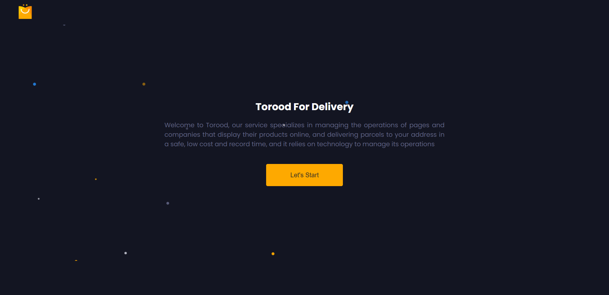
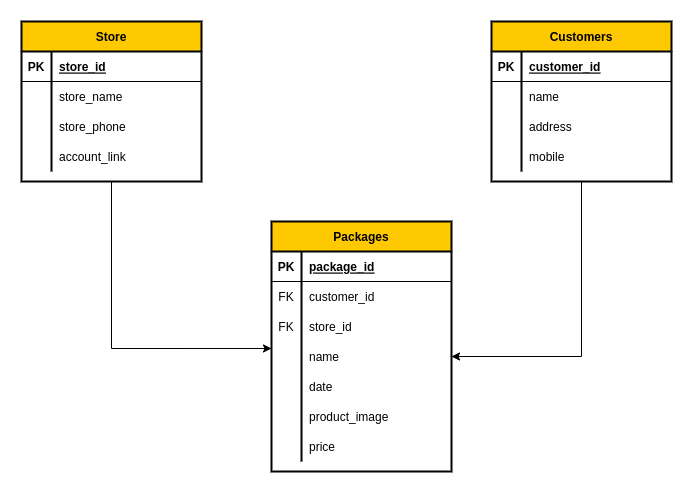

# Torood &#128230;

- [Description](#Description)
- [Features](#features)
- [Links](#Links)
- [User Journey](#Journey)
- [User stories](#stories)
- [Technologies](#Technology)
- [ERD](#ERD)
- [Setup](#setup)
- [Installation](#install)
- [Team Members](#team)

## ✧ Description

Torood Express is a Web-based services that specializes in managing the operations of pages and companies that display their products online, and delivering parcels to your address in a safe, low cost and record time, and it relies on technology to manage its operations.

## ✧ Features

- Simple UI.
- Responsive.
- Fetch data from Database.
- Handle user errors and server errors.

## ✧ Links

- [Live link](https://torood.herokuapp.com/)

## ✧ User Journey

When the store owner visits the site, he finds an introductory page on the site and then goes to his packages page, which contains all the packages he created previously.
The store owner can create a package by entering the store information and then entering the customer information and then entering the package information and the information must meet all the required conditions.

## ✧ User Stories

- As a store owner, I want to enter information about my store
- As a store owner, I want to enter information about the store's customers
- As a store owner, I want to enter information about the packages that I want to send to the customer such as date, price, customer information, store and product image

## ✧ Technology and Tools that we used

- HTML
- CSS
- JavaScript
- Express js
- Postgres
- Heroku

## ✧ Entity Relationship Digram

## ✧ Setup

> Dev Dependencies

- eslint
- nodemon
- jest

> Dependencies

- express
- pg

## ✧ Installing the project locally

- `https://github.com/GSG-G11/Torood`
- `code Torood`
- `npm i`
- `npm run start`

## ✧ Team Members
- [Manar Abedelhadi](https://github.com/manar-abed)
- [Nada Abuzaid](https://github.com/nada-abuzaid)